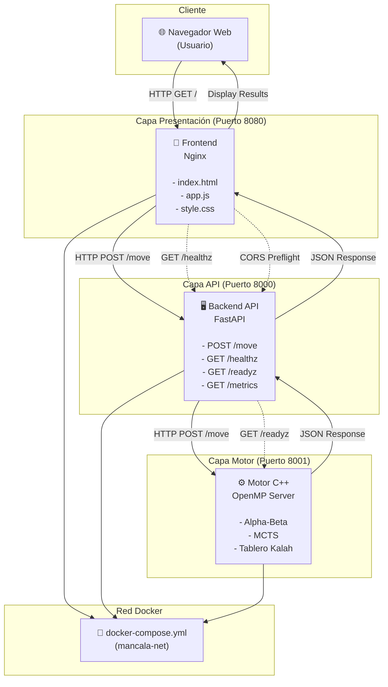

# 01 — Arquitectura: Backend, Frontend y Motor de Juego

## 1. Visión General

El proyecto Mancala está compuesto por una arquitectura de **tres capas microservicios** que funciona sobre contenedores Docker:

1. **Frontend Web** (nginx) — Interfaz de usuario HTML5/JavaScript
2. **Backend API** (FastAPI) — Wrapper y orquestador del motor
3. **Motor de Juego** (C++/OpenMP) — Servidor HTTP con algoritmos Alpha-Beta y MCTS

### Flujo de Solicitud

```
Usuario (Navegador)
    ↓ HTTP/HTTPS
[Frontend - nginx:8080]
    ↓ HTTP (localhost:8000)
[Backend - FastAPI:8000]
    ↓ HTTP (localhost:8001 / puerto interno)
[Motor C++ - raw socket:8001]
```

### Decisiones Arquitectónicas

| Aspecto | Elección | Justificación |
|--------|----------|--------------|
| Backend | FastAPI | Validación automática Pydantic, async-ready, documentación Swagger, Type hints |
| Frontend | HTML/JS Vanilla | Suficiente para MVP, no requiere build, ligero, sin dependencias externas |
| Base de Datos | Ninguna | Arquitectura stateless, métricas en memoria |
| Comunicación Inter-Servicios | HTTP/JSON | Simple, debuggeable, compatible con arquitectura existente del motor |
| Containerización | Docker Multi-stage | Optimización de tamaño de imagen |

---

## 2. Diagrama de Orquestación



---

## 3. Descripción de Contenedores

### 3.1 Frontend (nginx)

**Imagen:** `nginx:latest-alpine`

**Puerto:** `8080` (exposición) → `80` (interno)

**Contenido:**
- `index.html` — UI interactiva
- `app.js` — Lógica cliente (validación, peticiones HTTP, state management)
- `style.css` — Estilos responsive
- `nginx.conf` — Configuración del servidor (gzip, cache, healthcheck)

**Responsabilidades:**
- Servir la interfaz web
- Validación frontal de entrada
- Comunicación HTTP con Backend

**Healthcheck:** `GET http://localhost/healthz` → 200

### 3.2 Backend (FastAPI)

**Imagen:** Python 3.11-slim + FastAPI + uvicorn

**Puerto:** `8000` (exposición) → `8000` (interno)

**Módulos:**
- `main.py` — Aplicación FastAPI, rutas, middleware CORS
- `models.py` — Esquemas Pydantic (MoveRequest, MoveResponse, etc.)
- `config.py` — Configuración CORS, MOTOR_URL, timeouts
- `motor_client.py` — Cliente HTTP hacia el motor (wrapper async)

**Responsabilidades:**
- Validación estricta de entrada con Pydantic (HTTP 422 en error)
- Enrutamiento de solicitudes al motor
- Agregación de métricas (llamadas, tiempos, errores)
- Probes de salud y disposición (healthz, readyz)
- *Manejo de CORS explícito* (sin wildcards)

**Healthcheck:** `GET http://localhost:8000/healthz` → 200

**Dependencias de Red:**
- `MOTOR_URL=http://motor:8001` (conexión interna a motor)

### 3.3 Motor (C++ OpenMP)

**Imagen:** Compilada en Dockerfile multietapa

**Puerto:** `8001` (interno, no expuesto al host)

**Binarios:**
- `mancala_server` — Servidor HTTP raw socket
- `mancala_bench` — Benchmark (no usado en producción)

**Responsabilidades:**
- Ejecución de algoritmos Alpha-Beta y MCTS
- Cálculo de mejores movimientos
- Estadísticas de búsqueda (nodos, podas, rollouts)
- Probes de salud (healthz, readyz)

**Healthcheck:** `GET http://localhost:8001/healthz` → 200

**Ambiente:**
- `OMP_NUM_THREADS=4` — Threads OpenMP disponibles

---

## 4. Contrato API REST

### 4.1 POST /move

**Descripción:** Calcula el mejor movimiento para un estado de tablero dado.

**Request:**

```json
{
  "board": [4, 4, 4, 4, 4, 4, 0, 4, 4, 4, 4, 4, 4, 0],
  "side": 0,
  "algo": "alphabeta",
  "depth": 6,
  "simulations": null,
  "threads": 1
}
```

**Parámetros:**

| Campo | Tipo | Requerido | Rango | Descripción |
|-------|------|-----------|-------|-------------|
| `board` | array[int] | ✓ | 14 elementos, 0-48 c/u | Estado del tablero Kalah(6,4) |
| `side` | int | ✓ | 0 ó 1 | Jugador a mover |
| `algo` | string | ✓ | "alphabeta" ó "mcts" | Algoritmo de búsqueda |
| `depth` | int | (si algo="alphabeta") | 1-20 | Profundidad de búsqueda (Alpha-Beta) |
| `simulations` | int | (si algo="mcts") | 100-1,000,000 | Presupuesto de simulaciones (MCTS) |
| `threads` | int | ✓ | 1-64 | Threads OpenMP paralelos |

**Response (HTTP 200):**

```json
{
  "move": 1,
  "evaluation": -1.0,
  "elapsed_ms": 15,
  "stats": {
    "algo": "alphabeta",
    "nodes": 43039,
    "prunes": 8301
  },
  "threads_used": 1
}
```

**Response Field Descriptions:**

| Campo | Tipo | Descripción |
|-------|------|-------------|
| `move` | int | Índice del hoyo seleccionado (0-12) o -1 si no hay movimientos |
| `evaluation` | float | Evaluación heurística del movimiento (Alpha-Beta) o win_rate (MCTS) |
| `elapsed_ms` | int | Tiempo de ejecución en milisegundos |
| `stats.algo` | string | Algoritmo utilizado |
| `stats.nodes` | int | (Alpha-Beta) Nodos explorados |
| `stats.prunes` | int | (Alpha-Beta) Podas Alpha-Beta realizadas |
| `stats.rollouts` | int | (MCTS) Rollouts ejecutados |
| `stats.win_rate` | float | (MCTS) Tasa de victoria estimada [0,1] |
| `stats.tree_depth_avg` | float | (MCTS) Profundidad promedio del árbol |
| `threads_used` | int | Threads OpenMP utilizados |

**Errores:**

| Código | Descripción | Ejemplo |
|--------|-------------|---------|
| 422 | Validación de entrada fallida | board no es array de 14 elementos |
| 503 | Motor no disponible | Timeout, conexión rechazada |

**Ejemplos CURL:**

```bash
# Alpha-Beta
curl -X POST http://localhost:8000/move \
  -H "Content-Type: application/json" \
  -d '{
    "board": [4,4,4,4,4,4,0,4,4,4,4,4,4,0],
    "side": 0,
    "algo": "alphabeta",
    "depth": 6,
    "threads": 2
  }'

# MCTS
curl -X POST http://localhost:8000/move \
  -H "Content-Type: application/json" \
  -d '{
    "board": [4,4,4,4,4,4,0,4,4,4,4,4,4,0],
    "side": 1,
    "algo": "mcts",
    "simulations": 5000,
    "threads": 4
  }'
```

---

### 4.2 GET /healthz

**Descripción:** Liveness probe — verifica que el backend está vivo.

**Response (HTTP 200):**

```json
{
  "status": "ok"
}
```

**Características:**
- Siempre responde 200 si el backend está corriendo
- No verifica dependencias (ver `/readyz` para eso)
- Usado por Docker healthcheck

---

### 4.3 GET /readyz

**Descripción:** Readiness probe — verifica que backend y motor están listos.

**Response (HTTP 200):**

```json
{
  "status": "ready"
}
```

**Response (HTTP 503):**

```json
{
  "status": "not_ready"
}
```

**Características:**
- Retorna 200 si motor está accesible
- Retorna 503 si motor no responde o no está listo
- Usado por Kubernetes/docker-compose para determinar si aceptar tráfico

---

### 4.4 GET /metrics

**Descripción:** Retorna métricas agregadas acumuladas.

**Response (HTTP 200):**

```json
{
  "timestamp": "2024-06-07T15:30:45.123456",
  "metrics": {
    "backend_metrics": {
      "alphabeta": {
        "calls": 25,
        "total_time_ms": 450,
        "min_time_ms": 10,
        "max_time_ms": 35,
        "errors": 0
      },
      "mcts": {
        "calls": 10,
        "total_time_ms": 800,
        "min_time_ms": 50,
        "max_time_ms": 120,
        "errors": 1
      }
    },
    "motor_metrics": {
      "ab_calls": 25,
      "ab_nodes": 1250000,
      "ab_prunes": 125000,
      "mcts_calls": 10,
      "mcts_rollouts": 50000
    }
  }
}
```

**Propósito:**
- Monitoreo del rendimiento agregado
- Debugging de comportamiento
- Capacidad de observabilidad

---

## 5. Esquemas Pydantic

### 5.1 MoveRequest

```python
class MoveRequest(BaseModel):
    board: List[int]  # 14 enteros
    side: int  # 0 ó 1
    algo: str  # "alphabeta" ó "mcts"
    depth: Optional[int] = 8  # Solo para alphabeta
    simulations: Optional[int] = 10000  # Solo para MCTS
    threads: int = 1  # 1-64

    # Validaciones
    board must: len=14, all(x >= 0)
    side must: in [0, 1]
    algo must: in ["alphabeta", "mcts"]
    depth must: 1-20
    simulations must: 100-1,000,000
    threads must: 1-64
```

### 5.2 MoveResponse

```python
class MoveResponse(BaseModel):
    move: int
    evaluation: float
    elapsed_ms: int
    stats: Dict[str, Any]
    threads_used: int
```

### 5.3 HealthResponse

```python
class HealthResponse(BaseModel):
    status: str  # Always "ok"
```

### 5.4 ReadyResponse

```python
class ReadyResponse(BaseModel):
    status: str  # "ready" ó "not_ready"
```

### 5.5 MetricsResponse

```python
class MetricsResponse(BaseModel):
    timestamp: str  # ISO 8601
    metrics: Dict[str, Any]
```

---

## 6. Política CORS

### 6.1 Configuración Backend

**Orígenes Permitidos:**
```python
CORS_ORIGINS = [
    "http://localhost:8080",      # Frontend local
    "http://localhost:8000",      # Backend local (dev)
    "http://127.0.0.1:8080",      # Alternative localhost
    "http://127.0.0.1:8000",      # Alternative localhost
]
```

**Métodos Permitidos:**
```
GET, POST, OPTIONS
```

**Headers Permitidos:**
```
Content-Type, Accept
```

### 6.2 Preflight (OPTIONS)

**Solicitud:**
```http
OPTIONS /move HTTP/1.1
Origin: http://localhost:8080
Access-Control-Request-Method: POST
Access-Control-Request-Headers: Content-Type
```

**Respuesta:**
```http
HTTP/1.1 200 OK
Access-Control-Allow-Origin: http://localhost:8080
Access-Control-Allow-Methods: GET, POST, OPTIONS
Access-Control-Allow-Headers: Content-Type, Accept
Access-Control-Max-Age: 3600
```

### 6.3 Solicitud Posterior (con CORS verificado)

**Solicitud:**
```http
POST /move HTTP/1.1
Origin: http://localhost:8080
Content-Type: application/json
```

**Respuesta:**
```http
HTTP/1.1 200 OK
Access-Control-Allow-Origin: http://localhost:8080
Content-Type: application/json
```

### 6.4 NO Permitido

- Orígenes NO especificados (ej: `http://otro-dominio.com`)
- Métodos NO listados (ej: DELETE, PATCH)
- Headers NO permitidos

→ Navegador rechaza automáticamente (CORS error)

---

## 7. Flujo de Despliegue Local (Docker Compose)

```yaml
services:
  motor:
    build: ../../motor
    container_name: mancala-motor
    environment:
      OMP_NUM_THREADS: "4"
    networks:
      - mancala-net
    expose:
      - "8001"  # Internal only
    healthcheck:
      test: ["CMD", "curl", "-f", "http://localhost:8001/healthz"]

  backend:
    build: ../../backend
    container_name: mancala-backend
    environment:
      MOTOR_URL: "http://motor:8001"  # Resolves via docker DNS
    ports:
      - "8000:8000"  # Expose to host
    depends_on:
      motor:
        condition: service_healthy
    networks:
      - mancala-net
    healthcheck:
      test: ["CMD", "curl", "-f", "http://localhost:8000/healthz"]

  frontend:
    build: ../../frontend
    container_name: mancala-frontend
    ports:
      - "8080:80"  # Expose to host
    depends_on:
      - backend
    networks:
      - mancala-net

networks:
  mancala-net:
    driver: bridge
```

**Orden de inicio (automático via docker-compose):**
```
1. motor inicia, expone healthz en :8001
2. backend espera motor healthy
3. backend conecta a motor vía DNS interno: http://motor:8001
4. frontend inicia, comunica con backend en puerto 8000
```

---

## 8. Estructura de Directorios

```
Project-Mancala-Inteligencia-Artificial/
├── motor/                          # Motor C++ existente
│   ├── CMakeLists.txt
│   ├── Dockerfile
│   ├── src/
│   │   ├── server.cpp
│   │   ├── board.h
│   │   ├── alphabeta.h
│   │   └── mcts.h
│   └── tests/
│
├── backend/                        # Backend FastAPI NEW
│   ├── Dockerfile
│   ├── requirements.txt
│   ├── app/
│   │   ├── __init__.py
│   │   ├── main.py                # Aplicación FastAPI
│   │   ├── models.py              # Esquemas Pydantic
│   │   ├── config.py              # Configuración
│   │   └── motor_client.py        # Cliente HTTP del motor
│   └── tests/
│       ├── __init__.py
│       └── test_api.py            # Tests de endpoints
│
├── frontend/                       # Frontend HTML/JS/CSS NEW
│   ├── Dockerfile
│   ├── nginx.conf
│   ├── index.html
│   ├── app.js
│   └── style.css
│
├── deploy/
│   ├── local/
│   │   └── docker-compose.yml     # ACTUALIZADO
│   └── cloud/
│       └── k8s/
│
└── docs/
    ├── 01-arquitectura.md         # Este archivo NEW
    ├── 02-motor.md
    └── ...
```

---

## 9. Instrucciones de Uso

### 9.1 Construir y Ejecutar Localmente

```bash
cd deploy/local

# Construir imagenes
docker-compose build

# Iniciar servicios
docker-compose up -d

# Ver logs
docker-compose logs -f

# Parar servicios
docker-compose down
```

### 9.2 Probar Endpoints

```bash
# Healthz backend
curl http://localhost:8000/healthz

# Readyz backend
curl http://localhost:8000/readyz

# POST /move
curl -X POST http://localhost:8000/move \
  -H "Content-Type: application/json" \
  -d '{"board":[4,4,4,4,4,4,0,4,4,4,4,4,4,0],"side":0,"algo":"alphabeta","depth":6,"threads":1}'

# Metrics
curl http://localhost:8000/metrics

# Frontend
open http://localhost:8080
```

### 9.3 Ejecutar Tests Backend

```bash
cd backend
pip install -r requirements.txt
pytest tests/ -v --cov=app
```

---

## 10. Decisiones de Diseño

| Decisión | Alternativa | Por Qué |
|----------|-----------|---------|
| FastAPI | Flask | Pydantic built-in, async support, documentación automática |
| HTTP entre servicios | gRPC | Simplicidad, debuggeabilidad, sin dependencias extra |
| No BD | PostgreSQL | Arquitectura stateless, métricas en memoria suficientes |
| Vanilla JS | React | MVP, sin compilación, sin node_modules |
| nginx | Caddy | Alpine linux ecosystem, configuración conocida |
| Docker multi-stage | Single stage | Reduce tamaño imagen, separación concerns |

---

## 11. Observabilidad

### 11.1 Logs

- **Backend:** Uvicorn logs (stdout) → docker logs
- **Motor:** Printf logs (stdout) → docker logs
- **Frontend:** Console logs (navegador DevTools)

### 11.2 Métricas

- **GET /metrics** — Agregadas por algoritmo, backend-side
- **Motor `/metrics`** — Estadísticas raw, plaintext format

### 11.3 Healthchecks

- Backend: `docker-compose ps` muestra estado
- Motor: Accesible vía readyz probe
- Frontend: Accesible vía GET /

---

## 12. Escalabilidad Futura

**Horizontal:**
- Múltiples instancias de backend detrás de load balancer
- Caché compartido (Redis) para métricas

**Vertical:**
- Aumentar `OMP_NUM_THREADS` en motor
- Aumentar limites de threads en config.py backend

**Observabilidad:**
- Integración Prometheus (métricas) + Grafana (dashboard)
- ELK stack (logs centralizados)
- Jaeger (tracing distribuido)

---

Documento de Arquitectura: **COMPLETADO** ✅

