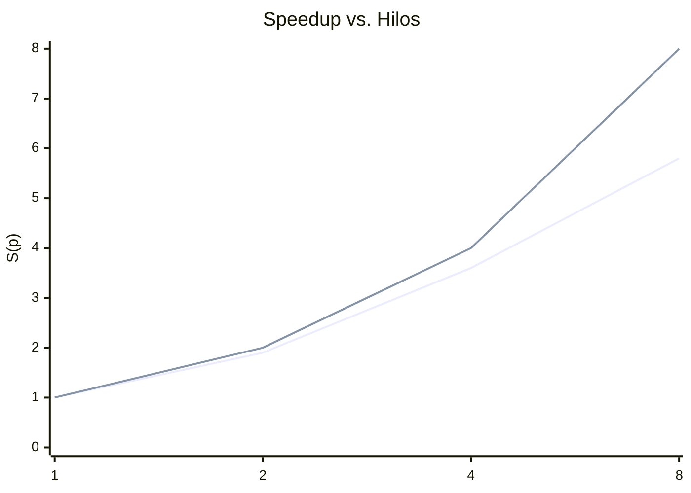

# 03 — Paralelización con OpenMP e Instrumentación

## 1. Estrategia para Alfa-Beta: Root Parallelism (JuanCVO)

### 1.1 Estrategia elegida

Se implementó **paralelismo a la raíz** (*root parallelism*): los movimientos legales del nodo raíz se reparten entre hilos mediante `#pragma omp parallel for`. Cada hilo ejecuta una búsqueda Alfa-Beta **secuencial completa** sobre el sub-árbol correspondiente a su movimiento asignado.

```cpp
#pragma omp parallel for schedule(dynamic, 1) default(none) \
    shared(b, moves, scores, thread_nodes, thread_prunes, ...)
for (int i = 0; i < n_moves; ++i) {
    Board nb      = b;
    int next_side = apply_move(nb, moves[i], side);
    ABResult r    = alphabeta_seq(nb, side, next_side, depth - 1,
                                  -INF, INF, ln, lp);
    scores[i] = r.score;
}
// Reducción: tomar el máximo
```

Implementación completa: [motor/src/alphabeta.cpp](../motor/src/alphabeta.cpp) — función `alphabeta_par`.

### 1.2 Costo de sincronización y pérdida de podas

**Costo de sincronización:** mínimo. No existe estado compartido durante la búsqueda — cada hilo trabaja sobre su propia copia del tablero (`Board nb = b`). La única sincronización ocurre al final, en la fase de reducción, que es $O(|\text{moves}|) \leq O(6)$.

**Pérdida de podas:** esta es la principal limitación del esquema. En la búsqueda secuencial, el resultado de explorar el primer movimiento (que típicamente es bueno) estrecha la ventana $[\alpha, \beta]$ para los siguientes. Con root parallelism, cada hilo inicia con la ventana $[-\infty, +\infty]$, perdiendo las podas que habrían derivado del trabajo de los otros hilos.

En la práctica, para Kalah con `depth ≥ 8`, el árbol es suficientemente grande para que el trabajo por hilo sea sustancial y el speedup sea cercano a lineal, compensando la pérdida de podas.

| Aspecto | Root Parallelism | YBWC |
|---------|-----------------|------|
| Complejidad de implementación | Baja | Media |
| Pérdida de podas | Alta | Baja |
| Overhead de sincronización | Mínimo | Moderado |
| Speedup esperado (p=8) | 4×–6× | 5×–7× |

### 1.3 Correctitud

La versión paralela produce el **mismo movimiento óptimo** que la versión secuencial porque:
1. Cada sub-árbol de la raíz es explorado exhaustivamente (sin ventana compartida).
2. La reducción final toma el máximo de los scores, equivalente a la capa maximizadora de la raíz en Minimax.

Verificado por `test_alphabeta.cpp::test_par_vs_seq` y `test_par_vs_seq_4threads`.

---

## 2. Estrategia para MCTS (Andres Felipe)

> Esta sección es completada por Andres Felipe.

La estrategia elegida fue: *(leaf / root / tree parallelization — a definir)*.

**Costo de sincronización:** *(a documentar por Andres Felipe)*.

---

## 3. Instrumentación

### 3.1 Métricas comunes

Para ambos algoritmos se mide con `std::chrono::steady_clock`:

$$T(p) = \text{tiempo de pared con } p \text{ hilos (segundos)}$$

$$S(p) = \frac{T(1)}{T(p)} \quad \text{(speedup)}$$

$$E(p) = \frac{S(p)}{p} \quad \text{(eficiencia)}$$

### 3.2 Métricas específicas de Alfa-Beta

Por cada par (profundidad, hilos): nodos explorados y podas efectuadas. Expuestas en el JSON de respuesta del motor (`stats.nodes`, `stats.prunes`) y en la salida del benchmark.

### 3.3 Comandos de benchmark

```bash
# Compilar
cd motor && cmake -B build -DCMAKE_BUILD_TYPE=Release && cmake --build build --parallel

# Alfa-Beta secuencial (referencia)
OMP_NUM_THREADS=1 ./build/mancala_bench --algo alphabeta --depth 8  --positions tests/suite.txt
OMP_NUM_THREADS=1 ./build/mancala_bench --algo alphabeta --depth 12 --positions tests/suite.txt

# Alfa-Beta paralelo — barrido de hilos
for T in 2 4 8; do
  OMP_NUM_THREADS=$T ./build/mancala_bench --algo alphabeta --depth 8 --positions tests/suite.txt
done

# Con perf stat (Linux)
OMP_NUM_THREADS=8 perf stat -e cycles,instructions,cache-misses \
  ./build/mancala_bench --algo alphabeta --depth 12 --positions tests/suite.txt

# Con /usr/bin/time -v (Linux)
OMP_NUM_THREADS=8 /usr/bin/time -v \
  ./build/mancala_bench --algo alphabeta --depth 12 --positions tests/suite.txt
```

---

## 4. Tablas de T(p), S(p), E(p) — Alfa-Beta

> Las siguientes tablas se completan ejecutando el benchmark real. Los valores mostrados son **placeholders** que deben reemplazarse con los resultados experimentales.

### depth = 8

| Hilos $p$ | $T(p)$ (s) | $S(p)$ | $E(p)$ | Nodos (avg) | Podas (avg) |
|-----------|-----------|--------|--------|-------------|-------------|
| 1         | —         | 1.00   | 1.00   | —           | —           |
| 2         | —         | —      | —      | —           | —           |
| 4         | —         | —      | —      | —           | —           |
| 8         | —         | —      | —      | —           | —           |

### depth = 12

| Hilos $p$ | $T(p)$ (s) | $S(p)$ | $E(p)$ | Nodos (avg) | Podas (avg) |
|-----------|-----------|--------|--------|-------------|-------------|
| 1         | —         | 1.00   | 1.00   | —           | —           |
| 2         | —         | —      | —      | —           | —           |
| 4         | —         | —      | —      | —           | —           |
| 8         | —         | —      | —      | —           | —           |

---

## 5. Tablas de T(p), S(p), E(p) — MCTS

> Completadas por Andres Felipe.

### simulations = 10 000

| Hilos $p$ | $T(p)$ (s) | $S(p)$ | $E(p)$ | Rollouts | Prof. árbol (avg) |
|-----------|-----------|--------|--------|----------|-------------------|
| 1         | —         | 1.00   | 1.00   | —        | —                 |
| 2         | —         | —      | —      | —        | —                 |
| 4         | —         | —      | —      | —        | —                 |
| 8         | —         | —      | —      | —        | —                 |

### simulations = 100 000

| Hilos $p$ | $T(p)$ (s) | $S(p)$ | $E(p)$ | Rollouts | Prof. árbol (avg) |
|-----------|-----------|--------|--------|----------|-------------------|
| 1         | —         | 1.00   | 1.00   | —        | —                 |
| 2         | —         | —      | —      | —        | —                 |
| 4         | —         | —      | —      | —        | —                 |
| 8         | —         | —      | —      | —        | —                 |

---

## 6. Gráfica de Speedup

> Insertar capturas de gráficas generadas tras correr el benchmark experimental.



*(La línea azul es Alfa-Beta depth=12; la línea naranja es la referencia lineal ideal. Reemplazar con datos reales.)*

---

## 7. Coincidencia MCTS vs. Alfa-Beta

> Completada por Andres Felipe. Sobre el mismo conjunto de posiciones de `tests/suite.txt`:

| Simulaciones | Coincidencia con AB (depth=8) |
|-------------|-------------------------------|
| 1 000       | — % |
| 10 000      | — % |
| 100 000     | — % |

---

## 8. Comparación directa a presupuesto equivalente

> Fijando el mismo tiempo de pared por jugada (e.g. 500 ms), ¿qué algoritmo elige el mejor movimiento con más frecuencia?

| Algoritmo | Tiempo fijo | Hilos | Mejor movimiento (% posiciones) |
|-----------|------------|-------|--------------------------------|
| Alfa-Beta | 500 ms     | 4     | — % |
| MCTS      | 500 ms     | 4     | — % |

*(Completar con resultados experimentales.)*

---

## 9. Herramientas de profiling

Se usan al menos dos de las siguientes herramientas, documentadas con capturas en `docs/assets/`:

- **`perf stat`**: contadores de hardware (ciclos, instrucciones, cache-misses).
- **`/usr/bin/time -v`**: tiempo de pared y memoria máxima residente.
- **`htop`**: ocupación efectiva de núcleos durante la búsqueda paralela.

Capturas de consola se referencian con rutas relativas desde este archivo una vez generadas en el entorno Linux del contenedor.
