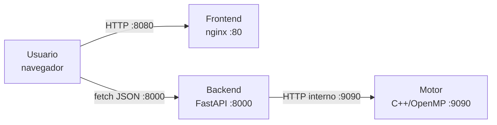
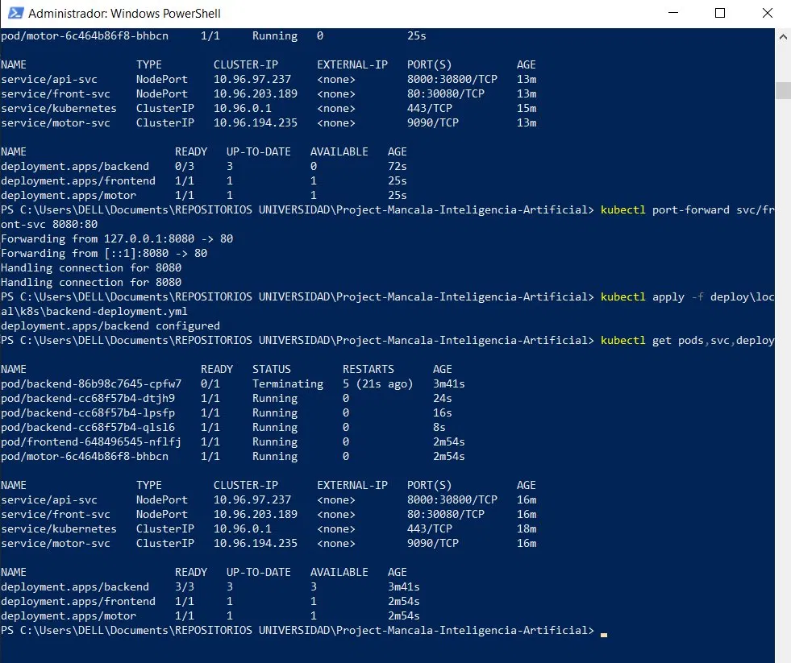
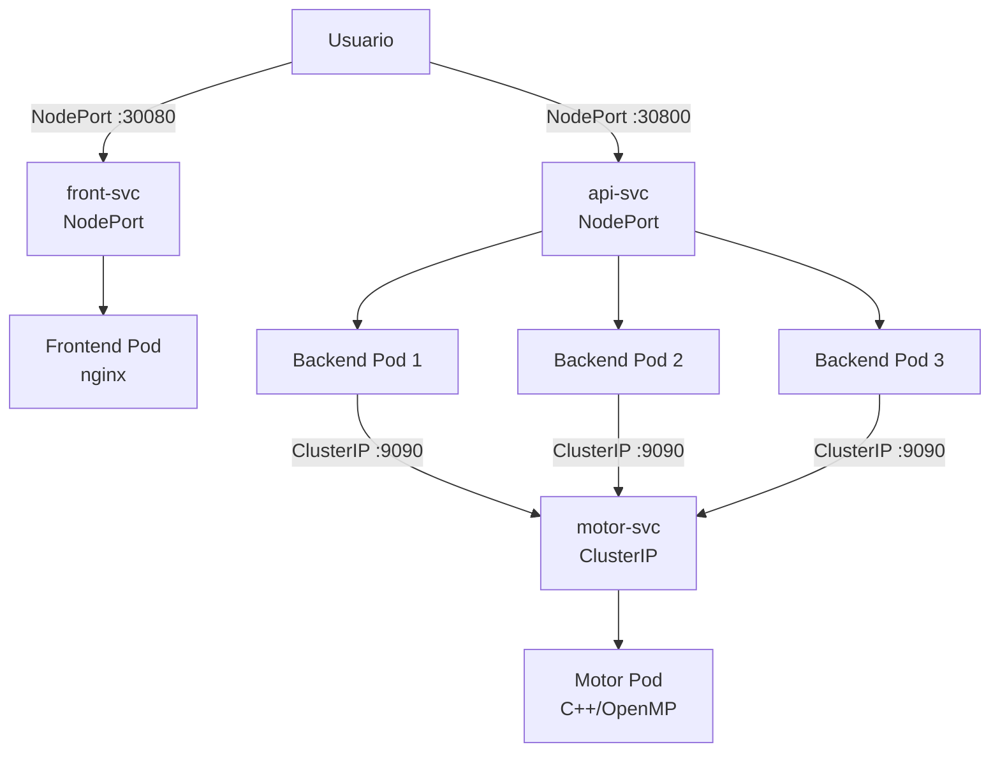

# 04 — Despliegue Local

## Dockerfiles

Cada componente vive en su propio contenedor con su propio Dockerfile:

- `motor/Dockerfile` — compila el binario C++ con OpenMP
- `backend/Dockerfile` — instala dependencias Python con FastAPI
- `frontend/Dockerfile` — sirve los archivos estáticos con nginx

## Docker Compose

El archivo `deploy/local/docker-compose.yml` levanta los tres servicios
con un solo comando desde la raíz del repositorio:

```bash
docker compose -f deploy/local/docker-compose.yml up --build
```

El frontend queda disponible en `http://localhost:8080` y el backend
en `http://localhost:8000`. La variable `OMP_NUM_THREADS=4` se pasa
al motor y al backend vía la sección `environment` del compose.

## Flujo de contenedores



## Variables de entorno

| Variable | Valor | Descripción |
|---|---|---|
| OMP_NUM_THREADS | 4 | Hilos OpenMP para el motor |
| MOTOR_URL | http://motor:9090 | URL interna del motor |

## Kubernetes local con kind

### Requisitos

- kind v0.31+
- kubectl v1.34+

### Crear el clúster

```bash
kind create cluster --name mancala
kubectl cluster-info --context kind-mancala
```

### Aplicar manifiestos

```bash
kubectl apply -f deploy/local/k8s/configmap.yml
kubectl apply -f deploy/local/k8s/motor-deployment.yml
kubectl apply -f deploy/local/k8s/backend-deployment.yml
kubectl apply -f deploy/local/k8s/frontend-deployment.yml
kubectl apply -f deploy/local/k8s/services.yml
```

### Verificar pods

```bash
kubectl get pods,svc,deploy
```

Resultado esperado: 5 pods en estado `Running` —
1 motor + 3 backend + 1 frontend.



### Acceder al frontend

```bash
kubectl port-forward svc/front-svc 8080:80
```

Abrir `http://localhost:8080` en el navegador.

## Diagrama de servicios en Kubernetes



## ConfigMap del motor

El ConfigMap `motor-config` centraliza las variables compartidas:

| Variable | Valor |
|---|---|
| OMP_NUM_THREADS | 4 |
| DEFAULT_DEPTH | 8 |
| MOTOR_URL | http://motor-svc:9090 |

## Probes de salud

| Contenedor | Liveness | Readiness |
|---|---|---|
| motor | GET /healthz :9090 | GET /healthz :9090 |
| backend | GET /healthz :8000 | GET /readyz :8000 |
| frontend | GET / :80 | — |