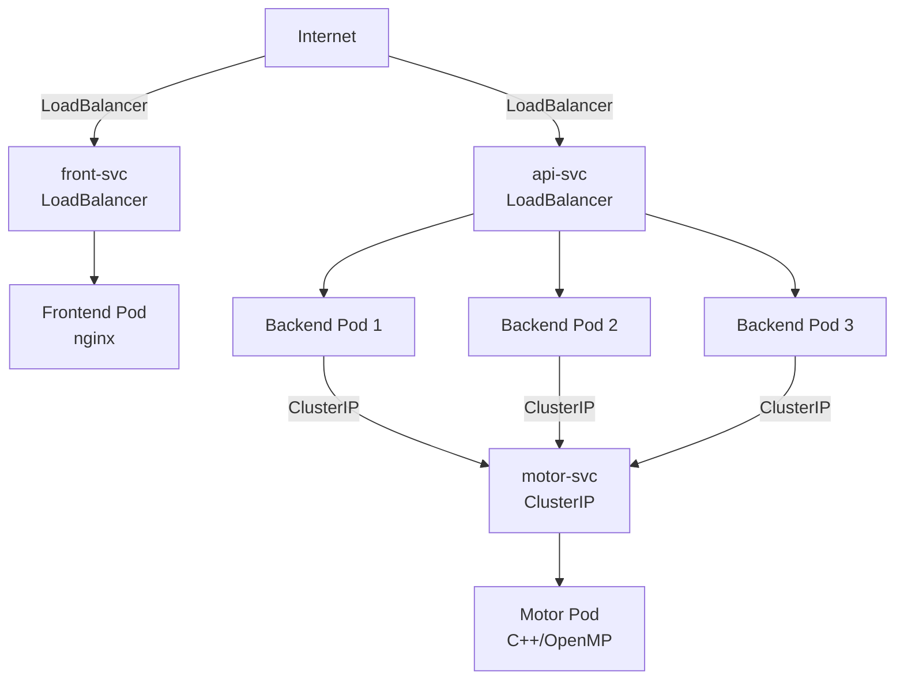
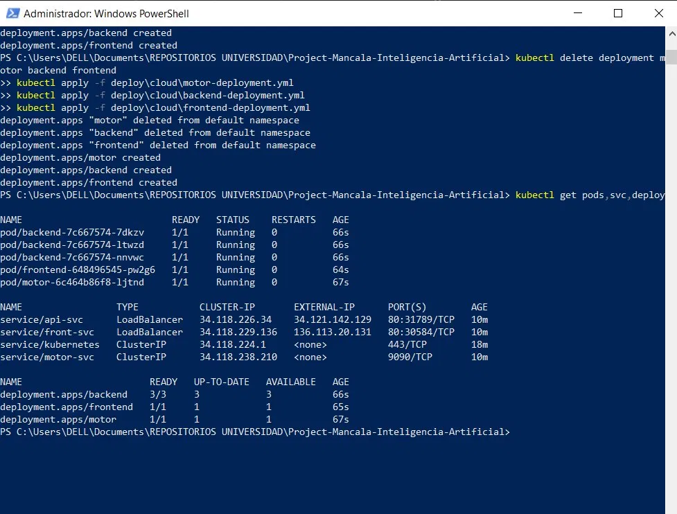

# 05 — Despliegue en la Nube

## Proveedor: Google Kubernetes Engine (GKE)

Se eligió GKE por los $300 USD de crédito gratuito para cuentas nuevas
y por la integración nativa con `kubectl`. El clúster se despliega en
`us-central1-a` con máquinas `e2-standard-2`.

## Crear el clúster

```bash
gcloud projects create mancala-proyecto-2026
gcloud config set project mancala-proyecto-2026
gcloud services enable container.googleapis.com

gcloud container clusters create mancala-cluster \
  --zone us-central1-a \
  --num-nodes 2 \
  --machine-type e2-standard-2
```

## Conectar kubectl al clúster

```bash
gcloud container clusters get-credentials mancala-cluster \
  --zone us-central1-a
kubectl get nodes
```

## Aplicar manifiestos

Toda la configuración está versionada en `deploy/cloud/`.
Nada se configuró desde la consola web del proveedor.

```bash
kubectl apply -f deploy/cloud/configmap.yml
kubectl apply -f deploy/cloud/motor-deployment.yml
kubectl apply -f deploy/cloud/backend-deployment.yml
kubectl apply -f deploy/cloud/frontend-deployment.yml
kubectl apply -f deploy/cloud/services.yml
```

## Diagrama del despliegue en GKE



## Recursos declarados

| Contenedor | CPU request | CPU limit | Mem request | Mem limit |
|---|---|---|---|---|
| motor | 500m | 2000m | 256Mi | 1Gi |
| backend | 250m | 1000m | 128Mi | 512Mi |
| frontend | 100m | 300m | 64Mi | 128Mi |

Los `requests` garantizan que el scheduler asigne nodos con recursos
suficientes. Los `limits` evitan que una búsqueda profunda de
Alfa-Beta monopolice la CPU del nodo.

## Tags de imagen

No se usa `latest` en producción para garantizar reproducibilidad.

| Imagen | Tag |
|---|---|
| usuario/mancala-motor | 1.0.0 |
| usuario/mancala-backend | 1.0.0 |
| usuario/mancala-frontend | 1.0.0 |

## Evidencia del despliegue



IP externa del frontend: `136.113.20.131`
IP externa del backend: `34.121.142.129`